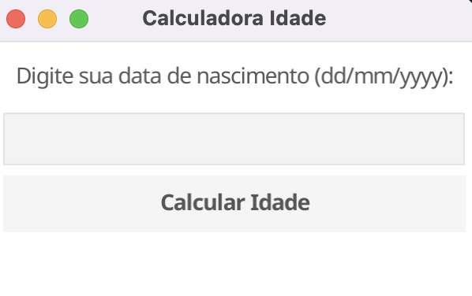

# 🧮 Calculadora de Idade em Go


Este é o meu primeiro projeto escrito em Go, uma calculadora simples que permite calcular a idade com base na data de nascimento.

## 📋 Pré-requisitos

Certifique-se de ter o Go instalado em seu sistema. Você pode verificar a instalação do Go executando o seguinte comando no terminal:

```shell
go version
```

## ▶️ Executando o Projeto

1. Clone este repositório em sua máquina local:

```shell
git clone https://github.com/darley-raffael/app-age-golang.git
```

2. Navegue até o diretório do projeto:

```shell
cd app-age-golang
```

3. Execute o projeto usando o comando `go run`:

```shell
go run main.go
```

Isso irá compilar e executar o código, e você verá a janela da calculadora de idade.

## 🎨 Personalização

Este projeto utiliza a biblioteca Fyne para criar a interface gráfica. Você pode personalizar a aparência da janela e dos componentes da interface alterando as propriedades no código-fonte.

## 🛠️ Ferramentas Usadas

- [Go](https://golang.org/) - A linguagem de programação utilizada.
- [Fyne](https://fyne.io/) - Biblioteca utilizada para criar a interface gráfica.

## 🤝 Contribuição

Contribuições são bem-vindas! Sinta-se à vontade para abrir uma issue ou enviar um pull request com melhorias, correções de bugs ou recursos adicionais.

